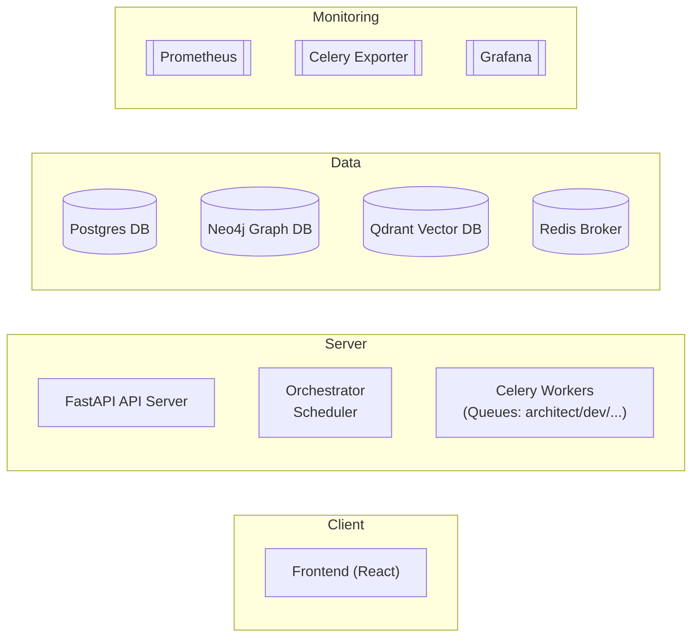

```mermaid
flowchart LR
    subgraph Client
      UI["Frontend (React)"]
    end
    subgraph Server
      API["FastAPI API Server"]
      ORCH["Orchestrator\nScheduler"]
      CELERY["Celery Workers\n(Queues: architect/dev/...)"]
    end
    subgraph Data
      PG[(Postgres DB)]
      Neo4j[(Neo4j Graph DB)]
      Qdrant[(Qdrant Vector DB)]
      Redis[(Redis Broker)]
    end
    subgraph Monitoring
      Prom[[Prometheus]]
      Exporter[[Celery Exporter]]
      Grafana[[Grafana]]
    end
```

