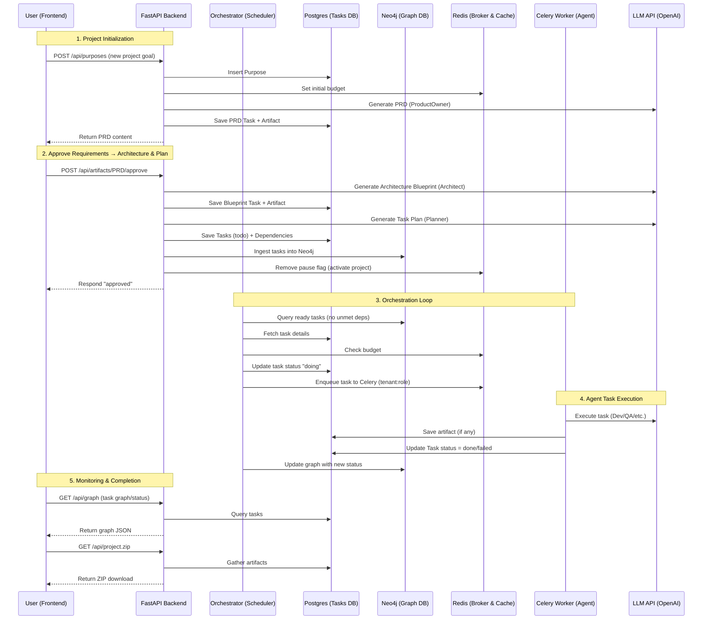
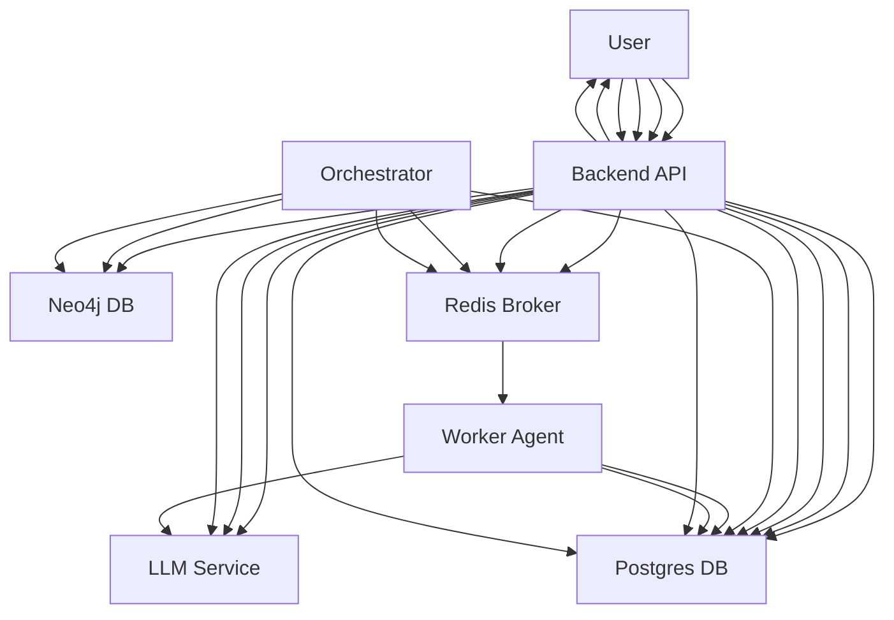

```mermaid
sequenceDiagram
    participant U as User (Frontend)
    participant API as FastAPI Backend
    participant ORCH as Orchestrator (Scheduler)
    participant PG as Postgres (Tasks DB)
    participant G as Neo4j (Graph DB)
    participant R as Redis (Broker & Cache)
    participant W as Celery Worker (Agent)
    participant LLM as LLM API (OpenAI)

    Note over U,API: 1. Project Initialization
    U->>API: POST /api/purposes (new project goal)
    API->>PG: Insert Purpose
    API->>R: Set initial budget
    API->>LLM: Generate PRD (ProductOwner)
    API->>PG: Save PRD Task + Artifact
    API-->>U: Return PRD content

    Note over U,API: 2. Approve Requirements → Architecture & Plan
    U->>API: POST /api/artifacts/PRD/approve
    API->>LLM: Generate Architecture Blueprint (Architect)
    API->>PG: Save Blueprint Task + Artifact
    API->>LLM: Generate Task Plan (Planner)
    API->>PG: Save Tasks (todo) + Dependencies
    API->>G: Ingest tasks into Neo4j
    API->>R: Remove pause flag (activate project)
    API-->>U: Respond "approved"

    Note over ORCH,W: 3. Orchestration Loop
    ORCH->>G: Query ready tasks (no unmet deps)
    ORCH->>PG: Fetch task details
    ORCH->>R: Check budget
    ORCH->>PG: Update task status "doing"
    ORCH->>R: Enqueue task to Celery (tenant:role)

    Note over W,LLM: 4. Agent Task Execution
    W->>LLM: Execute task (Dev/QA/etc.)
    W->>PG: Save artifact (if any)
    W->>PG: Update Task status = done/failed
    ORCH->>G: Update graph with new status

    Note over U,API: 5. Monitoring & Completion
    U->>API: GET /api/graph (task graph/status)
    API->>PG: Query tasks
    API-->>U: Return graph JSON
    U->>API: GET /api/project.zip
    API->>PG: Gather artifacts
    API-->>U: Return ZIP download

```

```mermaid
flowchart TB

    U[User]
    API[Backend API]
    ORCH[Orchestrator]
    W[Worker Agent]
    LLM[LLM Service]
    PG[Postgres DB]
    G[Neo4j DB]
    R[Redis Broker]

    U --> API
    API --> PG
    API --> R
    API --> LLM
    API --> PG

    U --> API
    API --> LLM
    API --> PG
    API --> LLM
    API --> PG
    API --> G
    API --> R

    ORCH --> G
    ORCH --> PG
    ORCH --> R
    ORCH --> R
    R --> W

    W --> LLM
    W --> PG
    W --> PG
    ORCH --> G

    U --> API
    API --> PG
    API --> U
    U --> API
    API --> PG
    API --> U

```
